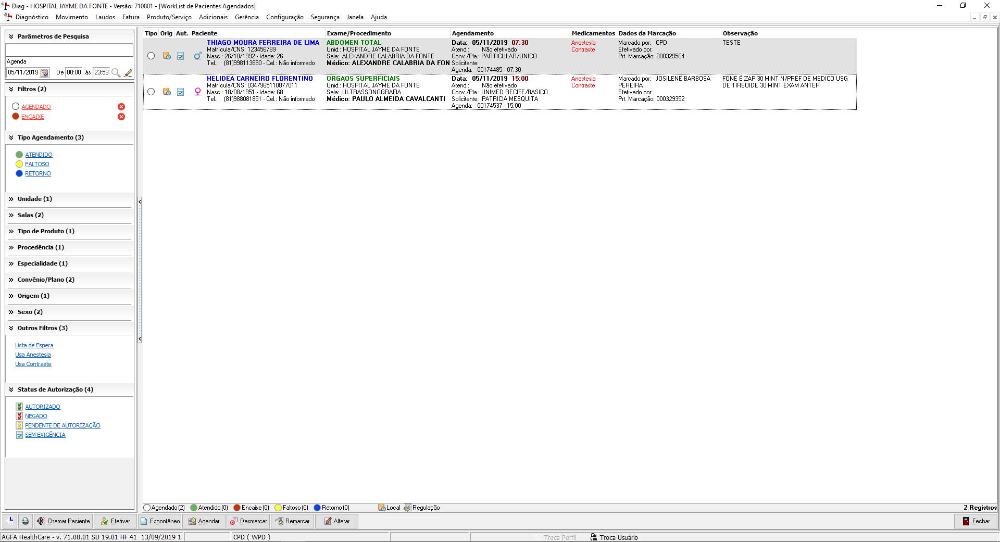
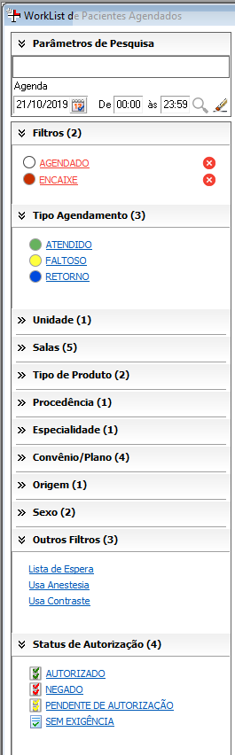
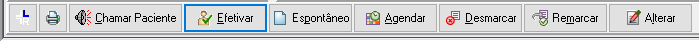
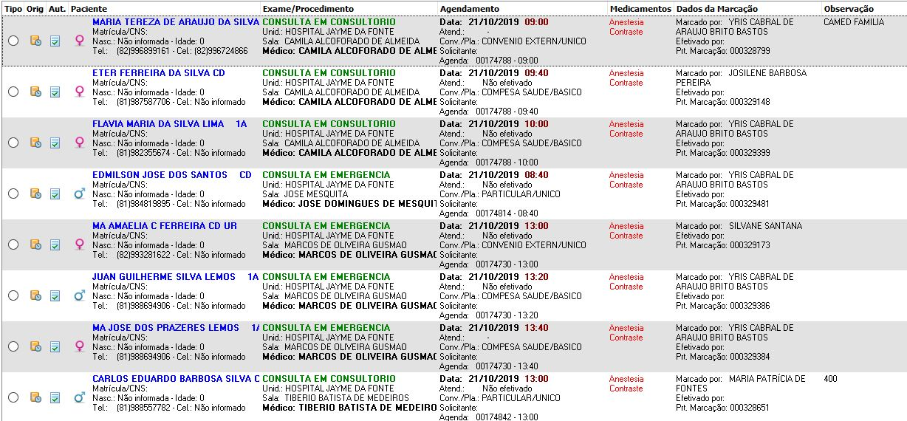
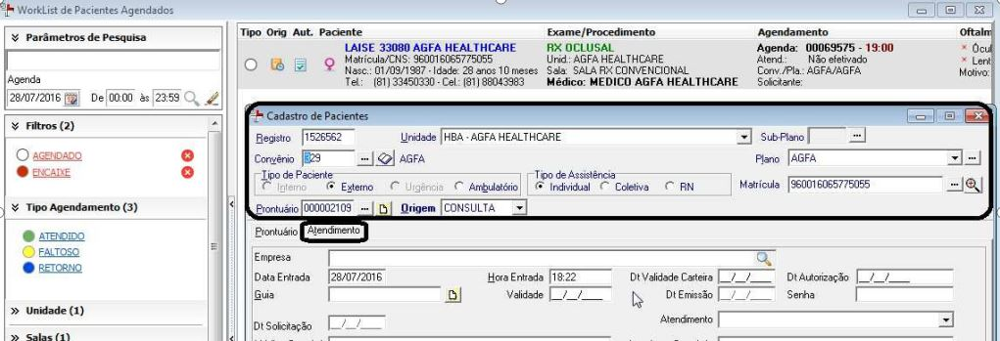
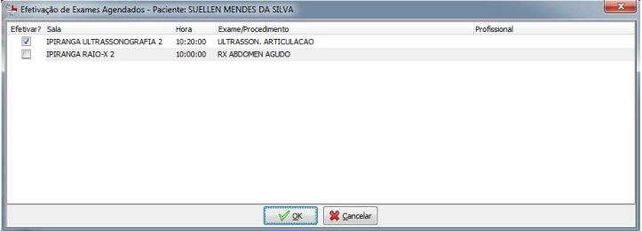
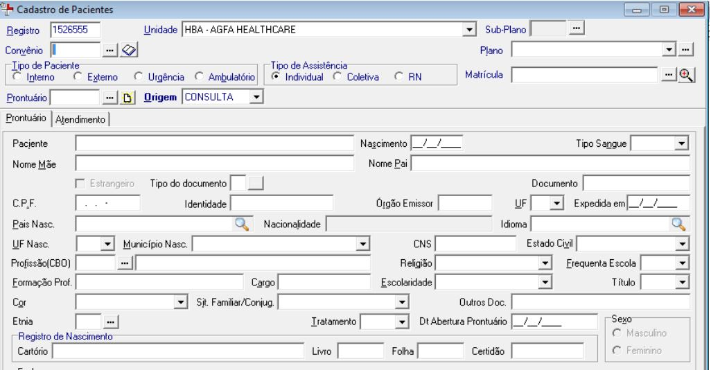

O atendimento inicia-se ao, na chegada do paciente, o mesmo irá retirar a senha de atendimento, após a chamada de senha pela fila correspondente ao terminal, será aberta a tela de Worklist de Pacientes agendados com todos os agendamentos registrados para aquele tipo de produto configurado na fila de atendimento.
É de suma imporãncia que a recepcionista preferencialmente faça o atendimento verificando se o paciente possui agendamento, para que assim possa dar entrada no(a) paciente em questão.

## **Tela de Worklist de Pacientes Agendados**

Ao abrir a tela de pacientes agendados o usuários terá disponivel algumas funconalidades dentro da tela como:

 - Parâmetros de pesquisa;

 

 - Botões para chamar paciente, efetivar um paciente agendado, fazer um atendimento avulso, entre outros;
 
 

 - Listagem de pacientes agendados para a data pesquisada;

 

## Efetivação de Paciente Agendado

Ao selecionar um registro de agendamento na worklist e clicar em efetivar, a tela de paciente será aberta com o cabeçalho preenchido com os dados do agendamento. Com foco no campo convênio para que o usuário confirme os dados. Ao  informar  os  campos  obrigatórios,  o  usuário  poderá  incluir  anexos  de  documentos  e imagens relacionados ao paciente através do botão Anexo.

Quando o paciente selecionado possuir mais de um exame agendado, será aberta a tela para seleção  opcional  dos  exames  agendados  disponíveis  para  efetivação.  Todos  os  exames selecionados irão compor a tela de movimento de exame.

## Atendimento Avulso

Para atendimentos sem agendamento, ou seja, avulsos. A tela de atendimento abrirá, apenas, com a unidade que o usuário tenha acesso.

O fluxo de atendimento é o mesmo aplicado hoje em dia. Sem alterações de layout;

