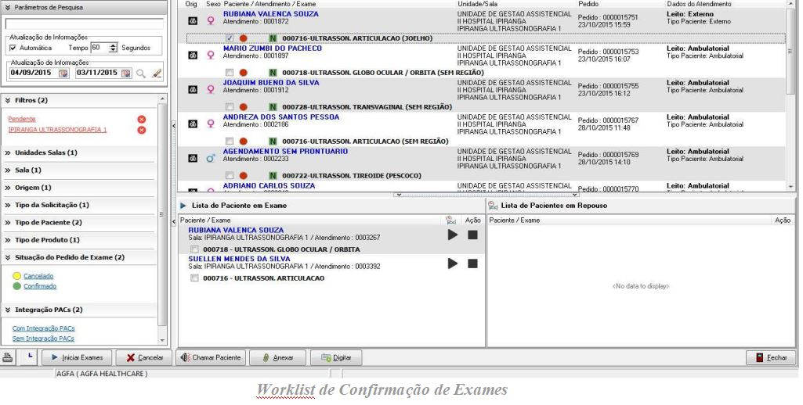
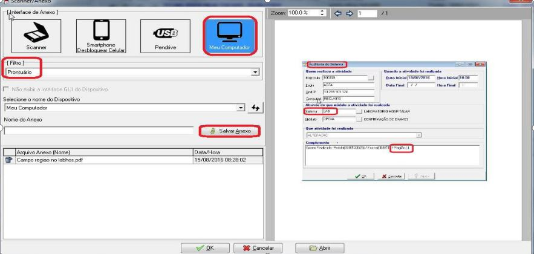
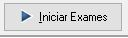
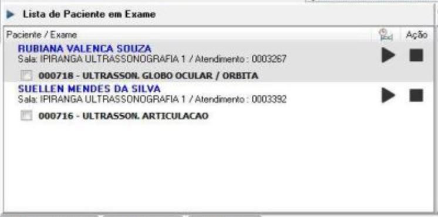

Continuando o atendimento após o paciente ter dado entrada no hospital, o funcionário deve acessar a tela de confirmação de exames, para que o paciente dê inicio pelo sistema aos procedimentos de exame.

### Chamar Paciente;
O botão  estará disponível por registro listado no grid. Quando acionado irá chamar no painel o paciente do registro acionado.

### Anexar documentos;
O anexo de documento será relacionado ao prontuário relacionado ao exame.

### Tela de Anexo

### Iniciar exames;
Ao selecionar um registro no grid, e clicar no botão Iniciar exames o paciente terá seu exame iniciado no Box.

Após o exame iniciado o paciente em questão ficara listado na tela de **Lista de Pacientes em Exame** 

Quando o paciente terminar o exameo atendente irá clicar no botão parar, para finalizar o exame. Após clicar o sistema irá perguntar se o atendente desejar finalizar atendimento do paciente, é nessa hora que é bastante importante atentar para não finalizar o atendimento do paciente clicando em NÂO.