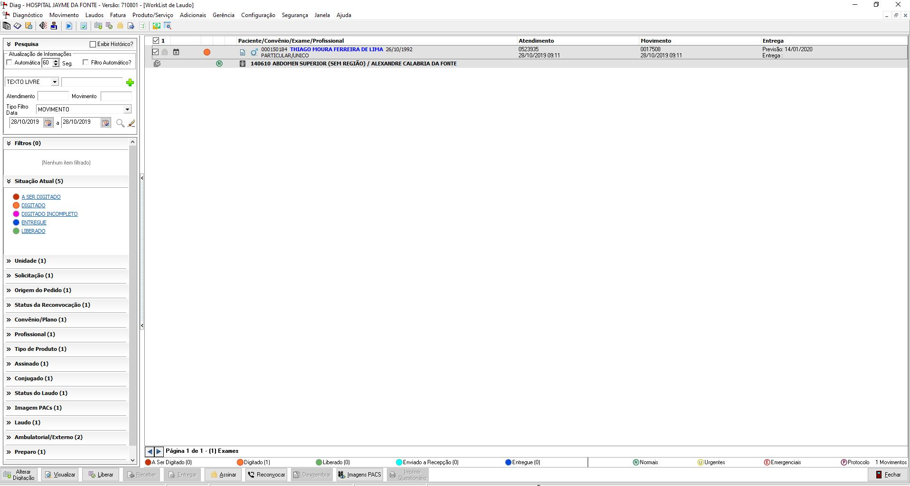
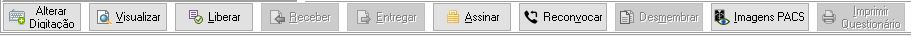
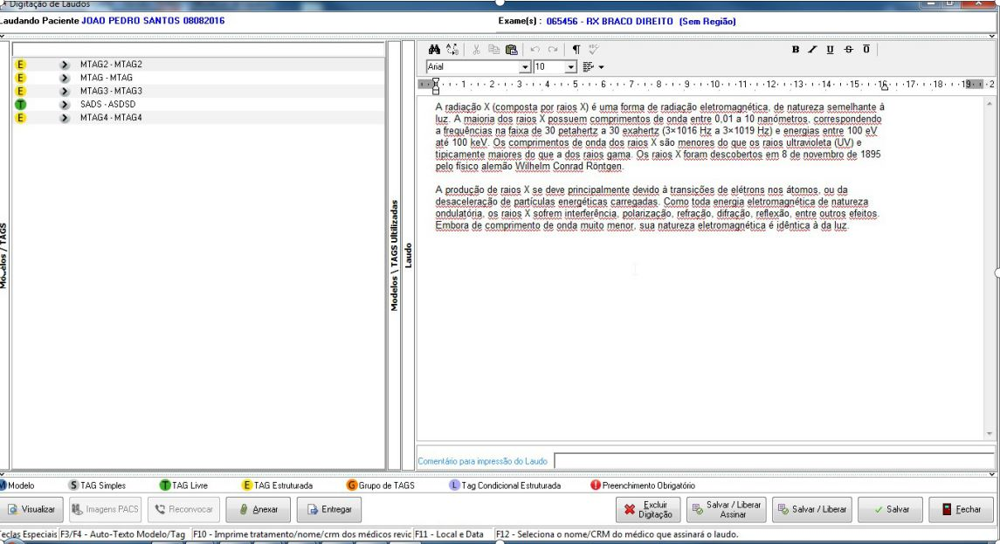
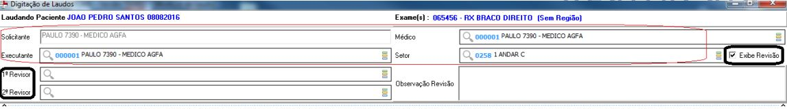
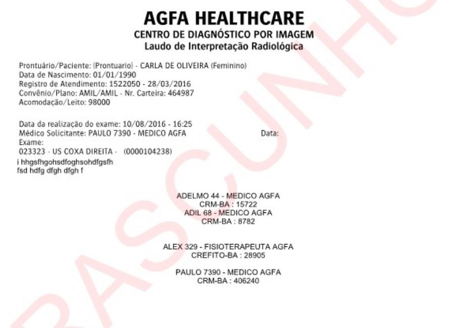
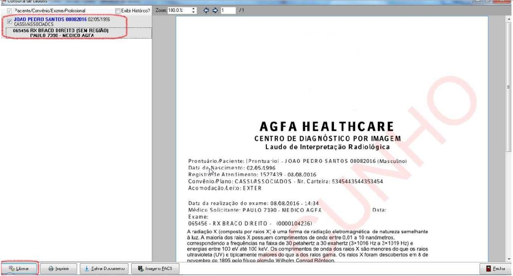
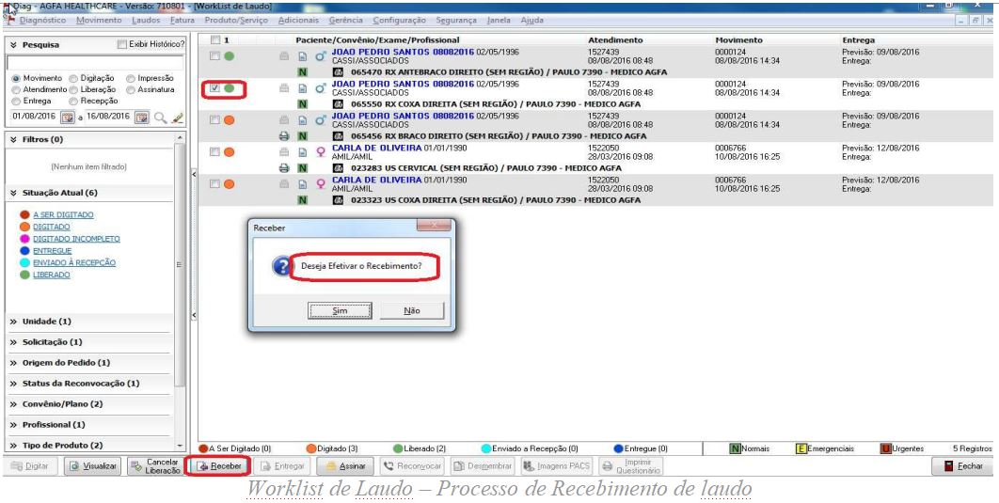
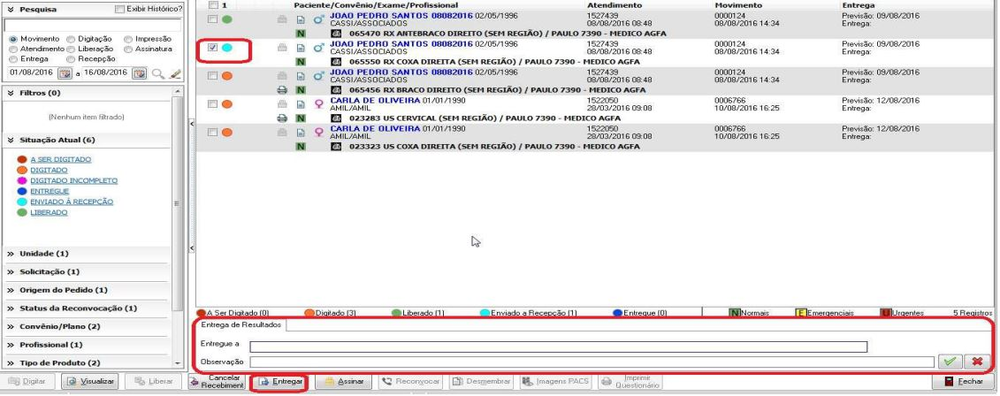

Após o paciente finalizar o exame no sistema, automaticamente estará habilitado para que o médico possa laudar o exame do paciente na tela abaixo:

Nessa Worklist foi agregado as funções do laudo desde a sua digitação, liberação, assinatura, impressão de laudo e entrega. A partir dessa tela, o usuário poderá realizar todas as funções de controle do laudo desde que tenha privilégio para acessá-las. Os privilégios serão os mesmos já utilizados. A medida que o tramite do laudo seja realizado, as funcionalidades da Worklist vão ficando disponíveis para utilização.

### Botões Worklist de Laudo

## Digitação de Laudos

Para começar o processo de digitação de Laudos o médico precisa clicar no primeiro botão do Grid de botões chamado **Digitação** onde será aberto a tela de digitação do Laudo para o médico laudar, caso o exame tenha modelo de laudo pronto basta clicar em cima do modelo que o mesmo irá aparecer o texto pre definido ao lado 

Na tela de digitação, será listado os modelos de laudo e tag’s que estão associados aos exames que compõem a digitação. Bem como os modelos e tag’s que não estão associados à nenhum exame.

O usuário poderá salvar a digitação, liberar o laudo, assiná-lo, imprimir através do botão Visualizar, anexar documentos e entregar o laudo após a sua liberação em tela. Através dessa tela de digitação, o usuário poderá realizar grande parte do tramite de laudo de imagem.

O cabeçalho do laudo poderá ser expandido para mostrar as informações de solicitante, executante, médico e setor. Além de exibir revisões do laudo, como a funcionalidade já existente

Na visualização, caso o laudo não esteja liberado, será visualizado com a Tarja de segurança “RASCUNHO”; Para imprimir um laudo com tarja de rascunho, só será possível através do privilégio especial em DIRLA - relatório de laudo/etiqueta.

Excluir Digitação: Ficará habilitada apenas para o laudo digitado, ao ser acionada irá excluir todo o conteúdo do laudo e o status do exame voltará para 'a ser digitado';

## Liberação de Laudos

Liberar exames que estejam digitados. A liberação poderá ser por Lote ou por registro.
A tarja de Rascunho será retirada e o usuário poderá seguir com o tramite de assinatura e/ou entrega do laudo.

Para realizar o processo de Liberação de laudo, o sistema irá mostrar o laudo na tela de visualização para que seja liberado. O usuário poderá liberar em lote ou de forma individual.

## Receber Laudos

Possibilita o controle de recebimento por parte da recepção dos laudos vindo das salas de exames. Funciona como um protocolo administrativo do tramite de laudos entre o setor de laudo e à recepção de entrega do laudo ao paciente. Para utilizar esse controle, o parâmetro: dia_controla_rec_laudo (Controla recebimento de laudo pela recepção) deve estar habilitado.

Para que o recebimento seja realizado, os laudos devem estar liberados não necessariamente assinados.

Após o recebimento, eles poderão ser entregues ao paciente.

## Entregar Laudos

Confirmação da entrega do exame ao paciente ou responsável, podendo imprimir um protocolo para este fim;

O processo de entrega está presente na digitação do laudo e também na worklist de laudo;

