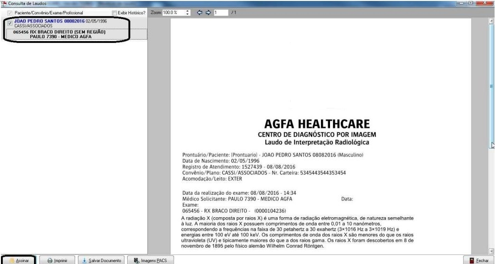

Nessa Worklist foi agregado as funções do laudo desde a sua digitação, liberação, assinatura, impressão de laudo e entrega. A partir dessa tela, o usuário poderá realizar todas as funções de controle do laudo desde que tenha privilégio para acessá-las. Os privilégios serão os mesmos já utilizados. A medida que o tramite do laudo seja realizado, as funcionalidades da Worklist vão ficando disponíveis para utilização.

## Digitação de Laudos

Os exames podem ter diversas origens e todos irão compor a worklist para serem digitados até o momento da sua entrega. Podem ter as seguintes origens:

Movimento de exame (diag- gerando comanda) Solicitação de Exames (Medview e Protocolo) Pedidos de exames (Posthos/Recep/Urgência);

Para os exames com digitação automática que foram digitados e não liberados na confirmação de exame, ao selecionar no grid esse registro, o botão Digitar será Alterar;

Na tela de digitação, será listado os modelos de laudo e tag’s que estão associados aos exames que compõem a digitação. Bem como os modelos e tag’s que não estão associados à nenhum exame.

O usuário poderá salvar a digitação, liberar o laudo, assiná-lo, imprimir através do botão Visualizar, anexar documentos e entregar o laudo após a sua liberação em tela. Através dessa tela de digitação, o usuário poderá realizar grande parte do tramite de laudo de imagem.

O cabeçalho do laudo poderá ser expandido para mostrar as informações de solicitante, executante, médico e setor. Além de exibir revisões do laudo, como a funcionalidade já existente

Na visualização, caso o laudo não esteja liberado, será visualizado com a Tarja de segurança “RASCUNHO”; Para imprimir um laudo com tarja de rascunho, só será possível através do privilégio especial em DIRLA - relatório de laudo/etiqueta.

Excluir Digitação: Ficará habilitada apenas para o laudo digitado, ao ser acionada irá excluir todo o conteúdo do laudo e o status do exame voltará para 'a ser digitado';

## Liberação de Laudos

Liberar exames que estejam digitados. A liberação poderá ser por Lote ou por registro.
A tarja de Rascunho será retirada e o usuário poderá seguir com o tramite de assinatura e/ou entrega do laudo.

A função de Liberação também está disponível na digitação automática como escrito anteriormente.

A informação de ‘Liberado por’ impressa no laudo só sairá caso o parâmetro mostra_info_emissao_laudo esteja habilitado.

Obs. Através de uma configuração, o sistema pode controlar o profissional que libera os laudos, solicitando no ato da liberação a senha do usuário. Para ativar esse controle basta habilitar a coluna: SN_SOLIC_SENHA_PROF_LIB_LAUDO / Tabela: TB_UNIDADE_CONFIG;

Para realizar o processo de Liberação de laudo, o sistema irá mostrar o laudo na tela de visualização para que seja liberado. O usuário poderá liberar em lote ou de forma individual.

Para controle de liberação de laudo, foi incluído uma rotina parametrizada na unidade. Essa rotina solicita a senha do usuário no momento da liberação do laudo. Essa rotina visa a segurança no processo de liberação do laudo.
Parâmetro: Solicita senha do profissional na liberação do laudo?

> (Caminho: Cadastro de Unidade > Aba Dados Adicionais); Funcionalidade opcional.

## Assinar Laudos

A assinatura digital é habilitada através de configuração na unidade do certificado digital

> (Caminho: Unidade de Atendimento > Certificação Digital > Usa Certificado Digital);

O profissional atrelado ao usuário deve ter configuração de assinatura através do seu cadastro na unidade (Caminho: Tela de Lista de Unidade -> botão profissional);

**CARACTERISTICA**: O usuário deverá ter o privilégio para o modulo: DIASS – Assinar Laudos;

Para Assinatura pelo botão da worklist de laudo, o sistema abrirá a tela de visualização do laudo antes para que o usuário visualize antes de assiná-lo;
O usuário precisa estar atrelado à um profissional com as configurações acima especificadas.

O processo de Assinatura poderá ser de forma individual na tela de digitação de laudo, ou em lote pela worklist de laudo.

As pendências de assinatura podem ser validadas quando o profissional logar no sistema com seu usuário. O sistema emite a mensagem abaixo de controle de assinaturas pendentes. A coluna SN_CHEC_PEND_LAUDO_LIB deve estar ‘S’ na tabela TB_UNIDADE_CONFIG.
Caso o profissional queira assinar suas pendências, ao clicar em sim, o sistema abrirá a tela de Worklist de laudo com todos os laudos liberados prontos para assinatura.

Obs. A configuração de Controle entre a Liberação do laudo e Assinatura. O profissional que liberou o laudo será o mesmo que assinará. Para ativar esse controle a coluna: SN_OBRIGA_PROF_ASS_LIBERACAO na tabela: TB_UNIDADE_CONFIG deve estar preenchida; Caso esteja desabilitada, o profissional que liberou não necessariamente precisa assinar o laudo.

## Receber Laudos

Possibilita o controle de recebimento por parte da recepção dos laudos vindo das salas de exames. Funciona como um protocolo administrativo do tramite de laudos entre o setor de laudo e à recepção de entrega do laudo ao paciente. Para utilizar esse controle, o parâmetro: dia_controla_rec_laudo (Controla recebimento de laudo pela recepção) deve estar habilitado.

Para que o recebimento seja realizado, os laudos devem estar liberados não necessariamente assinados.

Após o recebimento, eles poderão ser entregues ao paciente.

## Entregar Laudos

Confirmação da entrega do exame ao paciente ou responsável, podendo imprimir um protocolo para este fim;

O processo de entrega está presente na digitação do laudo e também na worklist de laudo;

