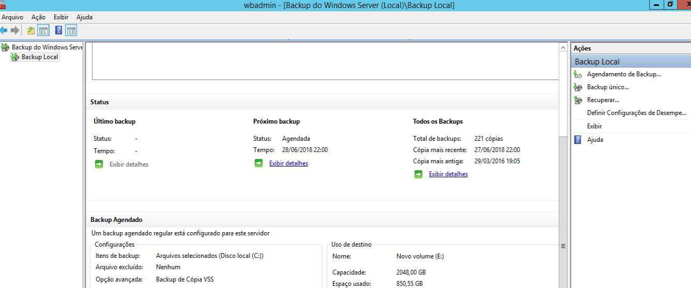
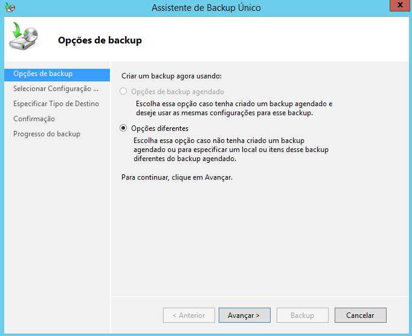
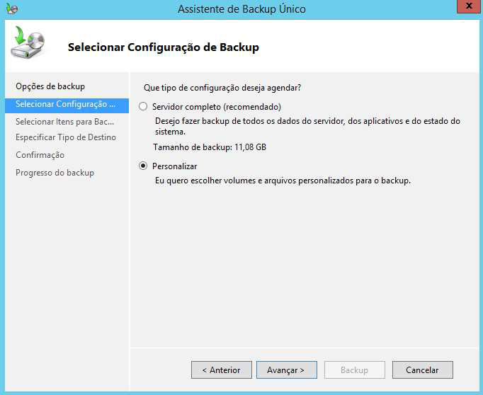
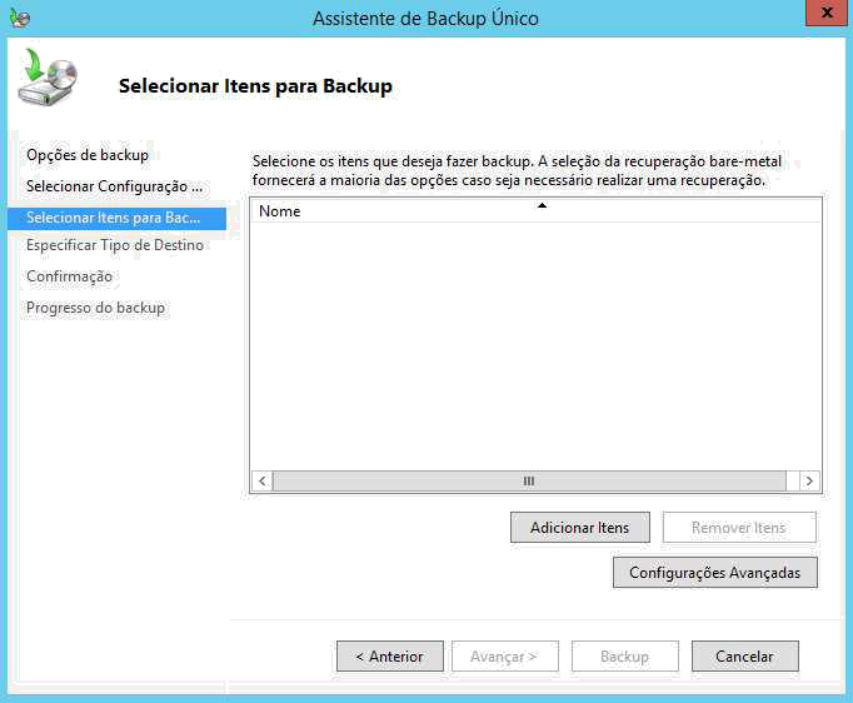
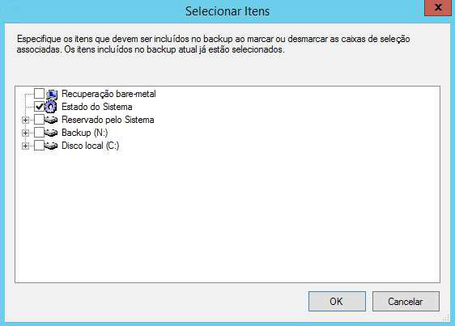
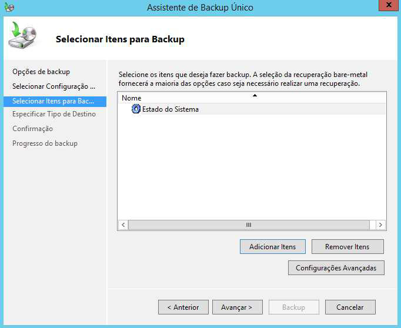
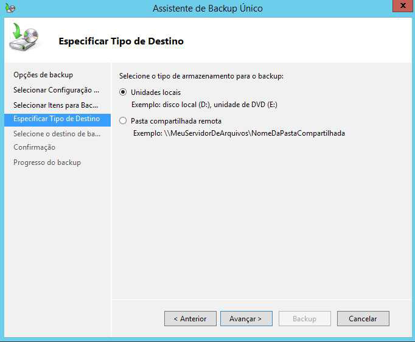
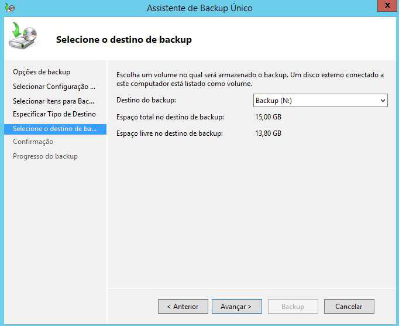
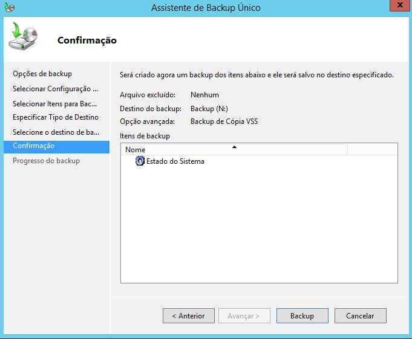
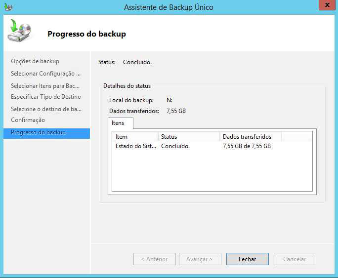

## Fazer backup do Estado do Sistema

Abra o recurso de Backup do Windows Server clicando em **Ferramentas > Backup** no painel de gerenciamento do servidor.

No Painel de Ações, clique no item **Backup Único…** para abrir o assistente de backup:

Na tela Opções de backup escolha a opção "Opções diferentes" para que possamos especificar os itens de backup desejados, e clique no botão Avançar:

Na tela Selecionar Configuração de Backup escolha a opção Personalizar e clique no botão Avançar:

Na tela Selecionar Itens para Backup clique no botão Adicionar Itens para que possamos escolher os itens que farão parte de nosso backup (no caso, o Estado do Sistema):

Na janela Selecionar Itens, marque a checkbox Estado do Sistema e clique no botão OK:

Após adicionar o item Estado do Sistema, clique no botão Avançar para prosseguir com o backup:

Na tela seguinte vamos especificar o tipo de destino.Marque a opção "Unidades locais". Clique em
Avançar:

Na tela Selecione o destino do backup, escolha a unidade que receberá os dados a serem salvos.

Na tela de Confirmação, verifique se o item Estado do Sistema está listado na janela de Itens do backup, e clique no botão Backup para iniciar a cópia de segurança dos dados do ADDS:

Esse processo pode levar vários minutos, devido ao volume de dados, e pode ser acompanhado na janela Progresso do backup:

Quando o backup estiver finalizado, você verá a mensagem Concluído no status da janela de Progresso do backup. Clique no botão Fechar para encerrar o processo.

A tela acima mostra que o backup foi concluído com sucesso.
