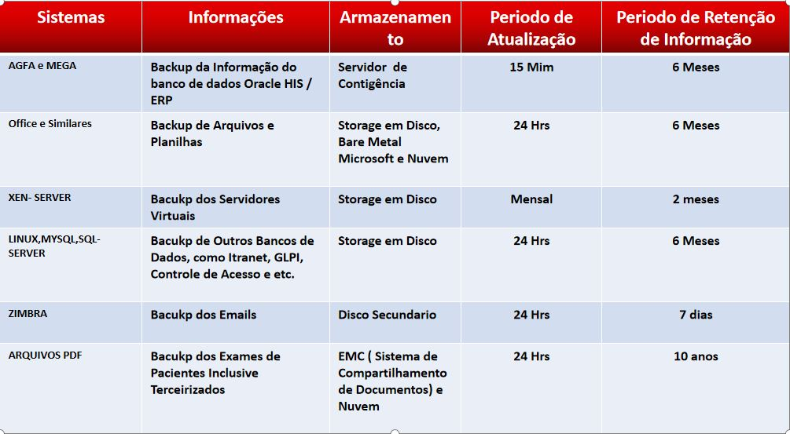

Sendo as informações um dos bens mais valiosos da empresa e estando estas informações armazenadas nos bancos de dados e Servidores da empresa, é de fundamental importância que tenhamos uma estratégia bem definida para a proteção destas informações.

Para isto é necessário ter uma política de Backup eficiente, onde o armazenamento das informações da Instituição deverá estar segura, evitando assim,  a perda ou violação dos conteúdos destas informações

## Tempo de retenção das informações

