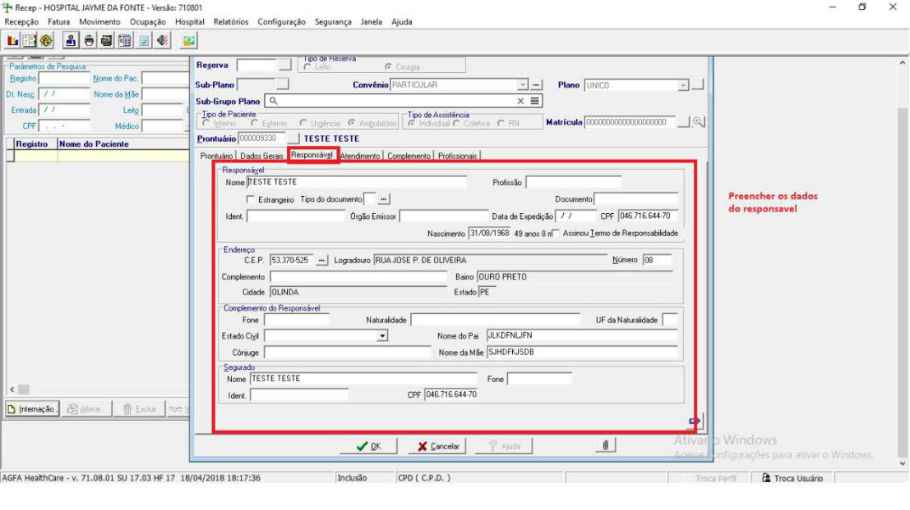
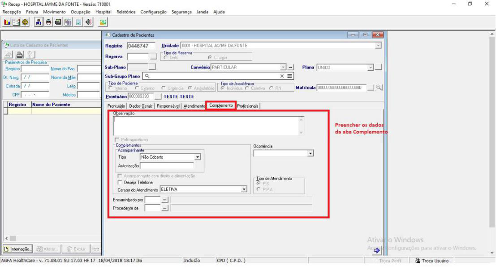
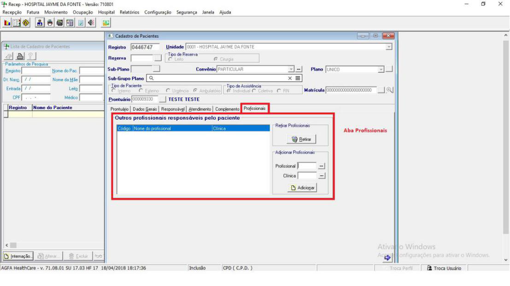
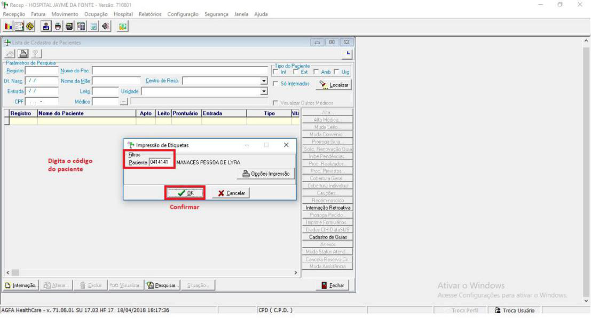

## Introdução

Este manual tem como objetivo orientar ao colaborador o passo a passo de como fazer o processo de admissão do paciente no sistema **RECEP**.

## Passo 1:

Para entrar no sistema é necessário colocar seu usuário e senha como forma de autenticação do usuário.

## Passo 2:

Em seguida clique no botão com ícone (Paciente) para entrar na área de pesquisa.

## Passo 3.

Caso seja um cadastro novo é necessário clicar no botão (Internação) conforme descrito na tela abaixo.

## Passo 4:

Ao abrir a tela de Cadastro de Pacientes terá a parte do cabeçalho onde será preenchido informações do convênio do paciente. Logo abaixo terá 6 abas para preenchimento da ficha de admissão

## Passo 5: 

Preencha todas as 6 abas do formulário de cadastro de paciente. Mostraremos cada uma abaixo:

### 5.1 Cadastro aba Dados gerais

### 5.2 Cadastro aba Responsável

### 5.3 Cadastro aba atendimento

### 5.4 Aba Complemento

### 5.5 Aba Profissionais

### 5.6 Aba Prontuário

## Passo 6:

Caso o paciente não cadastro prévio, basta apenas cadastrar um novo, no campo prontuário há um link para a tela de cadastro

## Passo 7:

Confirmar o cadastro do paciente no sistema apertando o OK e ira aparecer as telas para impressão de formulários do sistema

## Passo 8:

Para imprimir etiquetas pulseira e de paciente no sistema

### 8.1 Selecionar a impressora.

### 8.2 Retirar a etiqueta solicitada

