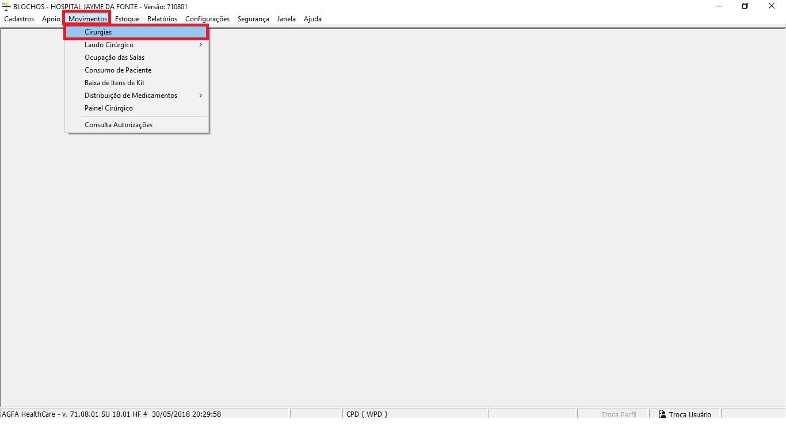
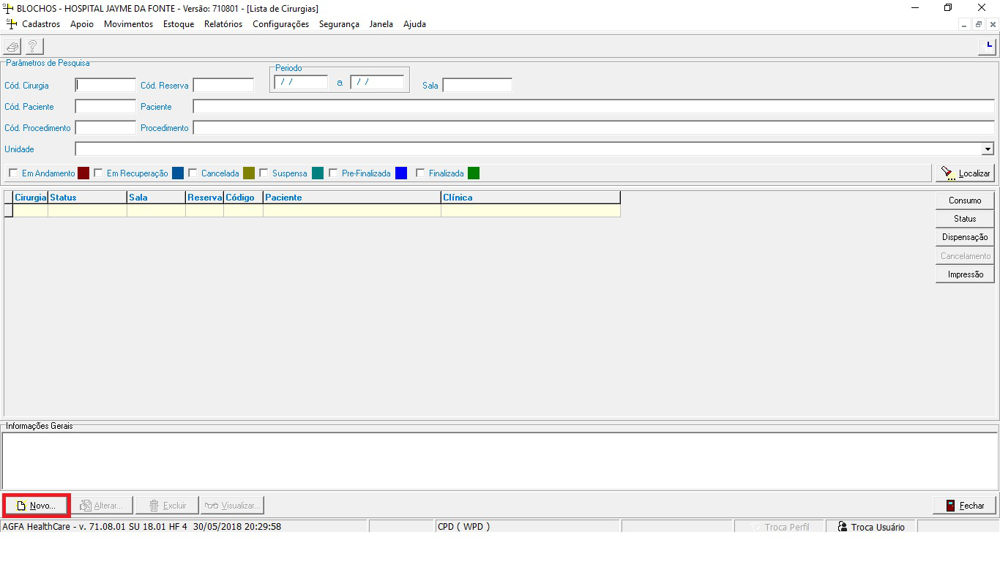
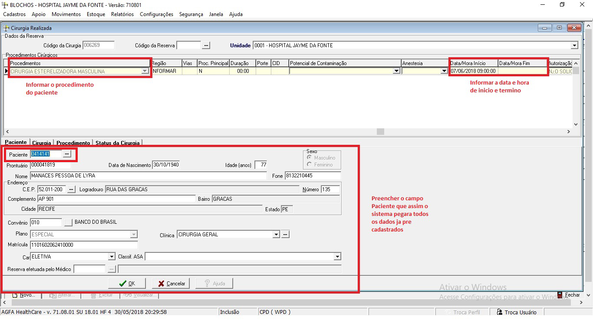
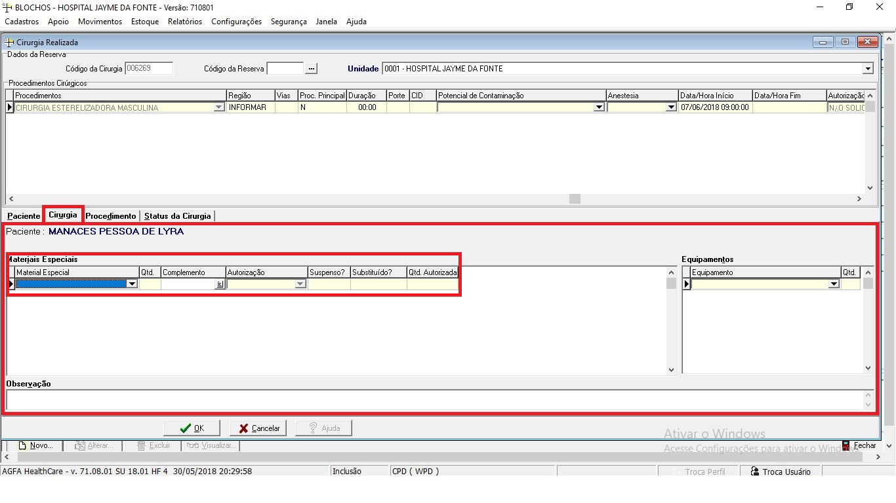
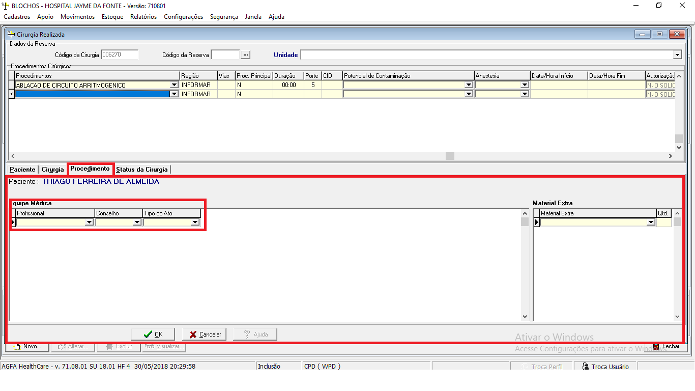
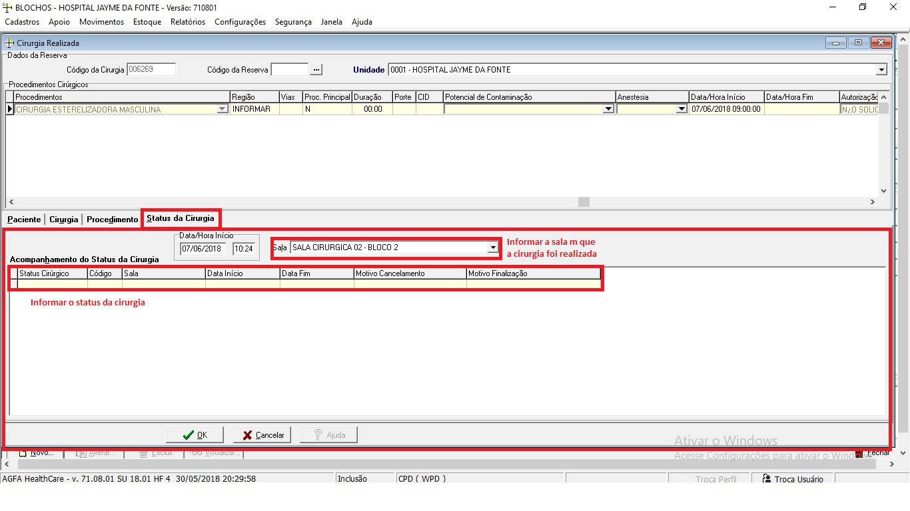

## Introdução

Este manual tem como objetivo instruir os colaboradores que trabalham no bloco cirúrgico a como cadastrar pacientes em procedimentos de cirurgia realizada bem como atualizar os status dos mesmos.

## Acessar tela Movimentos > Cirurgia

Ao logar no sistema Blochos o usuário deve acessar a tela de Movimentos > Cirurgia.

## Inserindo um novo registro

Para que o usuário possa inserir um novo registro de cirurgia realizada, ao abrir a tela de cirurgias o usuário deve clicar no botão novo.

## Alimentando as cirurgias realizadas

Ao entrar no formulário de cirurgias realizadas o usuário conectado deverá preencher todos os campos pertinentes a cirurgia realizada pelo paciente

Informar os materiais usados na cirurgia:

Informar os profissionais que realizaram o procedimento:

Informar o status da cirurgia e a sala em que foi realizada:

