## Introdução

O Ocomon é um sistema de Helpdesk voltado para o gerenciamento de chamados de suporte e controle integrado de inventário para equipamentos de informática. Possui controle de SLAs e Prioridades de atendimento e está em constante evolução.

## Como acessar o Ocomon

O Ocomon pode ser acessado através de um atalho na área de trabalho da sua estação, atalho com o nome **Helpdesk** e icone de um cadeado. Ou através do navegador (browser)
padrão. Abra o navegador e digite o endereço, seguido de **enter**:
[HELPDESK](http://helpdesk/).

Na tela de **login** do Ocomon, digite seu usuário e senha de acesso, depois clique no botão **Entrar**:

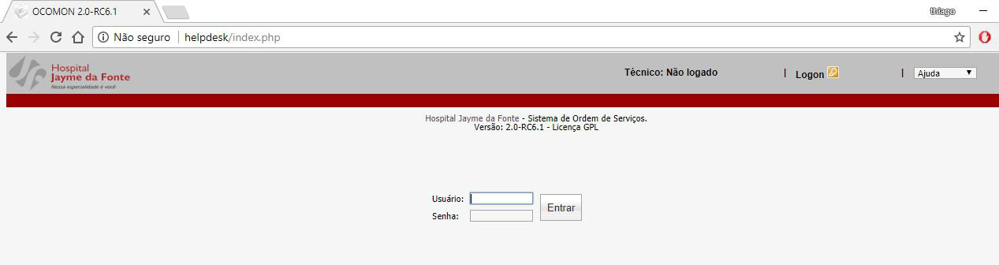

## Barra Principal

A barra principal do Ocomon traz informações básicas da sessão em curso, como o nome do usuário que está conectado, as opções de menu para as funcionalidades do sistema às quais o usuário tem permissão de acessar e a palavra Logoff, em destaque, que serve para finalizar a sessão e desconectar o usuário.

**ABA HOME:** através desta aba o usuário poderá ver todos os chamados abertos por ele, assim como mudar senha, esquema de cores e troca de idioma.

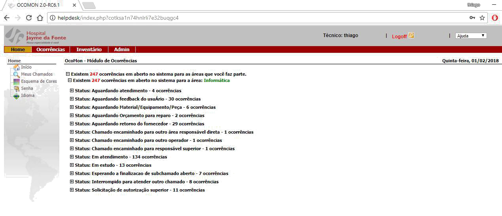

**ABA OCORRÊNCIAS:** através dela o usuário poderá abrir novos chamados e consultar os chamados já abertos, assim como encerrá-los se for o caso.

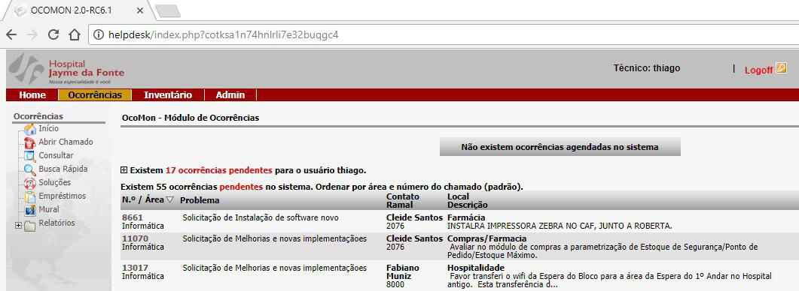

> **Obs.:** algumas informações apresentadas podem não estar presentes no ambiente para usuário final, estas telas foram tiradas com uso de um usuário administrador. As abas **Inventário** e **Admin**, são de uso exclusivo dos administradores do sistema, desta forma estão inacessíveis.

## Alteração de Senha

Todos os usuários de sistema são criados com a senha padrão (definida pelo administrador). No primeiro acesso ao sistema o usuário pode alterar sua senha de acesso para uma senha pessoal (que é recomendável mas não obrigatório). Além desta primeira, troca, é recomendável trocar periodicamente a senha, para sua própria segurança.

Para alterar a senha, na aba Home, selecionar a opção Senha. Na tela que se abre, informar a senha atual no campo **Senha atual** e a senha nova nos campos **Nova senha** e Confirmar, tecle em **Alterar**. Na próxima vez que se conectar ao sistema já deverá informar a nova senha.

## Como abrir um chamado

Para registrar um novo chamado, na aba **Ocorrências**, selecione o menu **Abrir Chamado**. Preencha os campos da tela de Abertura de Ocorrências e ao final clique no botão OK.

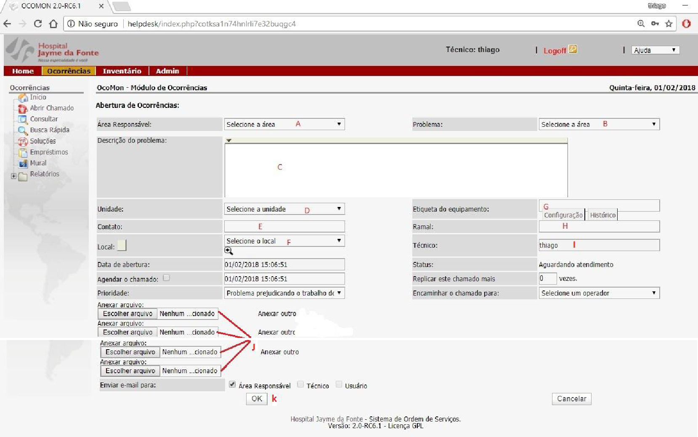

> **Atenção:** o botão OK só é habilitado quando todas as informações obrigatórias tiverem sido preenchidas.

O preenchimento adequado e completo dos campos é muito importante porque estas informações, além de serem usadas para análise e resolução do problema de forma mais rápida, são a fonte de cálculos de muitas métricas e indicadores.

A seguir as recomendações básicas para correto preenchimento de cada campo.

### Área Responsável

O campo Área Responsável **A** indica para qual equipe a ocorrência é direcionada.

> **Importante:** A correta identificação da Área Responsável é fundamental para que a ocorrência seja direcionada para os setores responsáveis.

### Problema

No campo Problema **B** indique o tipo de incidente objeto desta ocorrência.

Este campo tem a função de organizar as demandas dentro da Área de responsabilidade. A lista de Problemas atualmente configurada no Ocomon está listada abaixo:

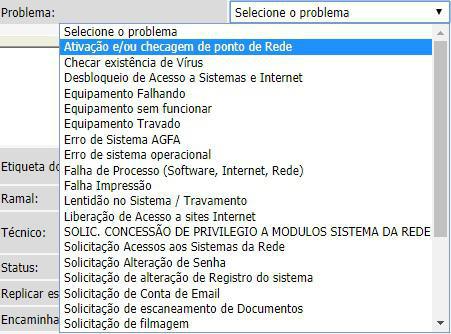

> **Aviso:** este campo poderá ser alterado conforme futuras necessidades.

### Descrição do Problema

No campo Descrição do problema **C** descreva o máximo de informações possível sobre o incidente. Lembre-se que quanto mais detalhes puder descrever, mais fácil e rápida será a identificação e aplicação de uma solução.

### Unidade

No campo Unidade **D** deve ser informada a unidade operacional que registra a ocorrência. Esta informação é muito útil para extração de métricas e identificação de problemas que possam estar afetando uma determinada unidade.

### Contato e Ramal

Em Contato **E** e Ramal **H** é possível preencher com o nome e o ramal do responsável pela abertura do chamado.

### Local

O Local **F** informado deve ser departamento de onde está acontecendo o problema.

> **Importante:** O Local é uma informação muito importante para acelerar o atendimento, especialmente quando a ocorrência precisar de atendimento presencial. Além disso, permite que se faça um acompanhamento do volume de chamados abertos por um determinado departamento ou centro, possibilitando identificar, por exemplo, necessidades de treinamento, revisões, e outras ações de melhoria.

### Técnico

Este campo **I** identifica apenas quem está abrindo o referido chamado.

### Anexos

O campo **J** permite inclusão de anexos, é possível anexar um arquivo, de tamanho limitado, ao chamado. Esta funcionalidade permitirá que, quando for necessário enviar o print de uma tela, este possa ser anexado à ocorrência. Na abertura do chamado é possível que o próprio solicitante anexe este arquivo. São aceitos documentos doc, .txt, .jpg, .xls, .htm, .ppt.

## Como acompanhar os chamados **Abertos por você mesmo**

Assim que uma ocorrência for registrada no sistema, uma mensagem é apresentada na tela, informando que o chamado foi aberto com sucesso e mostrando o número do chamado registrado. Este número pode ser usado para acompanhamento do chamado. Para consultar os chamados abertos por você,na aba **Home**, clique em **Meus chamados**. Do lado direito da tela serão mostrados todos os chamados abertos por você. Basta clicar sobre o número do chamado para ver mais detalhes sobre ele:

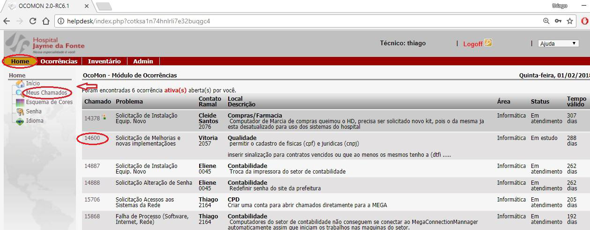

> **Dica:** No Ocomon os termos **assentamento** e **comentário** são usados para indicar registros de comentários, observações e informações sobre o atendimento do chamado. Consulte os assentamentos do seu chamado para saber o histórico de atendimento.

Na tela com os detalhes sobre o chamado é possível visualizar seu status de atendimento. No exemplo a seguir o chamado encontra-se Encerrado.

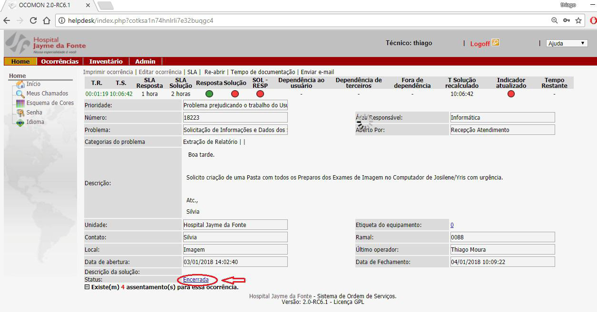

A visualização dos chamados **Meus chamados** permite consultar tanto os chamados ativos quanto os inativos (que são os Encerrados e Cancelados). Os chamados ativos são apresentados na parte superior à direita. Quando não houver chamados ativos, uma mensagem é apresentada, informando que não há chamados ativos.

## Inclusão de anexos

É possível anexar um arquivo, de tamanho limitado, ao chamado. Esta funcionalidade permitirá que, quando for necessário enviar o print de uma tela, este possa ser anexado à ocorrência. Na abertura do chamado é possível que o próprio solicitante anexe este arquivo. São aceitos documentos doc, .txt, .jpg, .xls, .htm, .ppt .pdf.

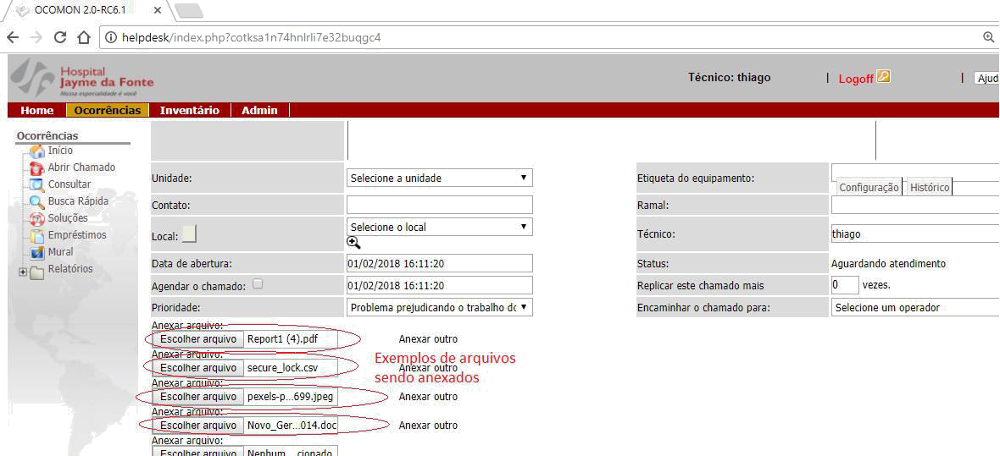

## Consultar Chamados

Também é possível consultar algum determinado chamado aberto, clicando dentro da aba **Ocorrências** no menu **Consultar** e **Busca Rápida**.

Abrirá uma tela para que o usuário defina os parâmetros de pesquisa para melhor filtrar os chamados.

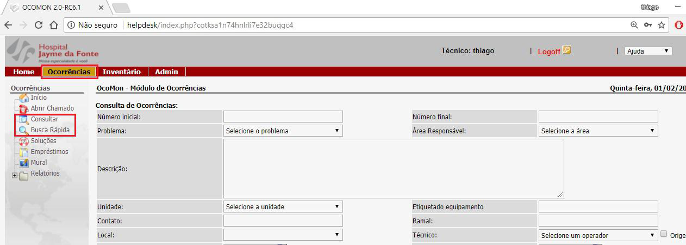

## Reabertura de Chamados

É possível reabrir um chamado depois que o mesmo tenha sido encerrado. Esta funcionalidade permite reabrir e documentar o motivo da reabertura.

A reabertura de um chamado é permitida quando, por quaisquer motivos, o objeto da ocorrência não tiver sido completamente solucionado (Importante: a reincidência de um problema sobre um mesmo equipamento que, após ter sido constatada sua resolução, deve ser objeto de um novo chamado):

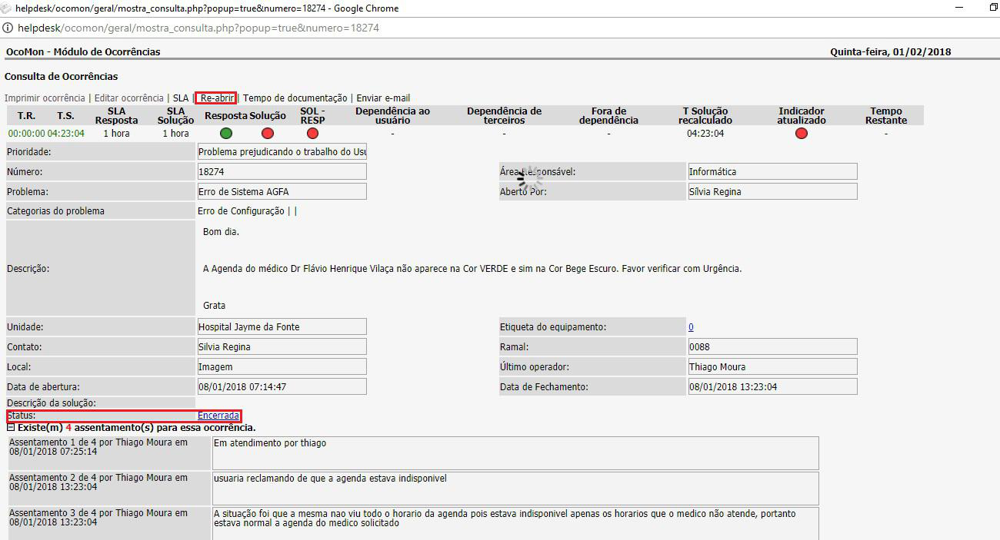

## Classificação de Prioridade

É possível definir a prioridade da ocorrência registrada. Somente problemas que indisponibilizem integralmente ou que comprometam sensivelmente um sistema ou serviço devem ter prioridades Máxima ou Alta registradas, caso contrário, se todas forem registradas com prioridade máxima, quando houver uma que de fato seja máxima, a equipe não conseguirá diferenciá-la e dar-lhe o tratamento adequado.

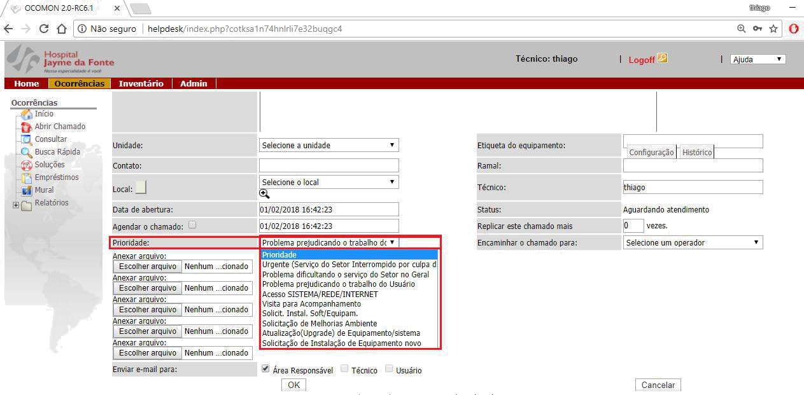

## Informações de SLA

Ao abrir o chamado é apresentado o tempo previsto para atendimento da ocorrência. Este tempo é a meta de atendimento pela equipe responsável, em condições normais de trabalho, podendo variar para mais ou para menos.

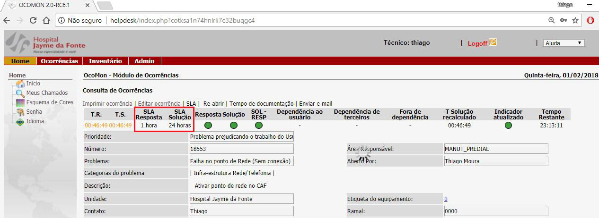

