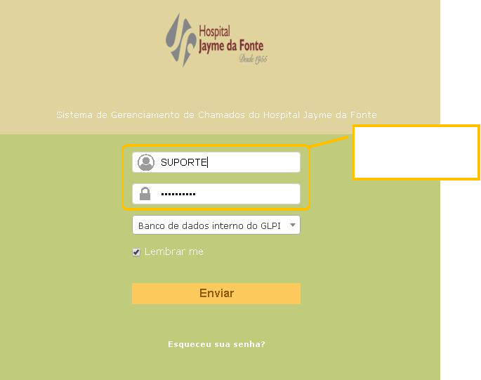
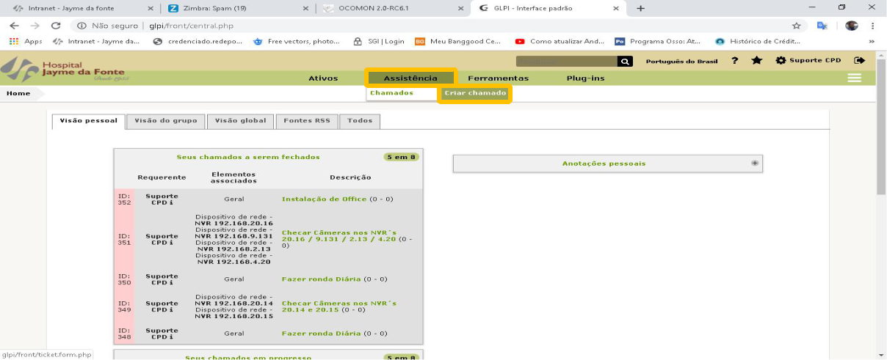
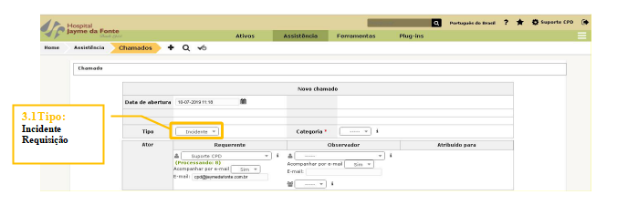
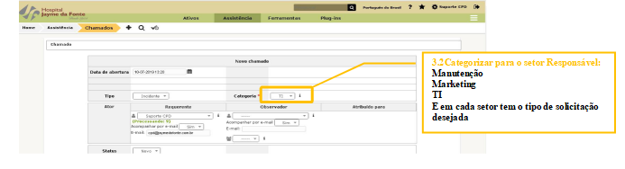
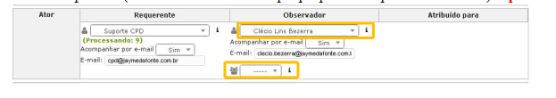
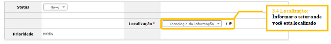
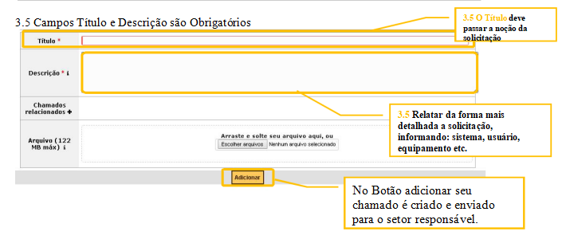

## Introdução

O GLPI é um sistema de Helpdesk voltado para o gerenciamento de chamados de suporte e controle integrado de inventário para equipamentos de informática. Possui controle de SLAs e Prioridades de atendimento e está em constante evolução.

## Responsável

Todos os usuários que necessitem abrir uma solicitação de serviço para os setores do Hospital.

## Abrangência

Todas as áreas do Hospital.

## Condições e Materiais Necessários

Computador,
Acesso à rede

## Como acessar o novo sistema de chamados

O GLPI pode ser acessado através de um atalho na área de trabalho da sua estação, atalho com o nome **Helpdesk** e icone de um cadeado. Ou através do navegador (browser)
padrão. Abra o navegador e digite o endereço, seguido de **enter**:
[HELPDESK](http://glpi/).

Na tela de **login** do Ocomon, digite seu usuário e senha de acesso, depois clique no botão **Entrar**:

Acesse a aba de Assistência e depois em Criar Chamado.

## Novo Chamado

### escolha o tipo :

**INCIDENTE** - Quando Ocorre um problema pontual (Ex. sem internet, Erro de sistema ou máquina não liga);

**REQUISIÇÃO** - Material, Maqueiro, Criação de usuário, mudança de equipamento de um setor para outro, Orientação ou Treinamento de sistema.

### Selecione a Categoria  do Chamado.

#### Selecione qual Categoria se destina o chamado

### No campo Ator (Selecionar usuário ou Grupo que pode acompanhar o chamado). Opcional

 ### Campo Localização é obrigatório

### Campos Título e Descrição são Obrigatórios

