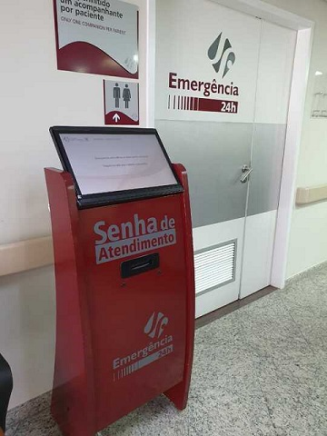
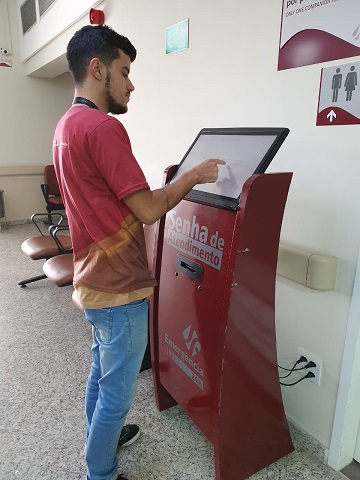
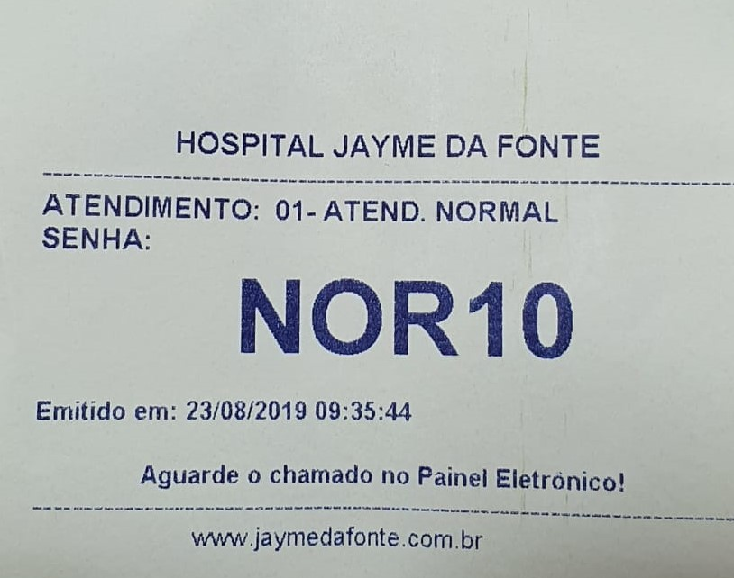

O fluxo do prontuário eletrônico na urgência será iniciado na chegada do paciente ao hospital, onde o mesmo irá retirar a senha no totem que localiza-se na recepção.

Para retirar a senha o paciente precisa digirir-se ao totem onde o mesmo estará exibindo uma tela de boas-vindas. Para dar inicio ao processo de retirada de senha, o paciente precisa tocar na tela onde aparecerá a pergunta de qual o tipo de atendimento desejado.

> **Obs.:** Se for atendimento normal clicar na opção normal, se for preferencial clicar na opção preferencial.

Ao selecionar o tipo de atendimento o totem automaticamente irá fazer a impressao da ficha na ordem de chegada do paciente.

Após retiradada ficha, o paciente aguardará na recepção ser chamado no painel para dar entrada no hospital, realizando a ficha de atendimento da urgência

