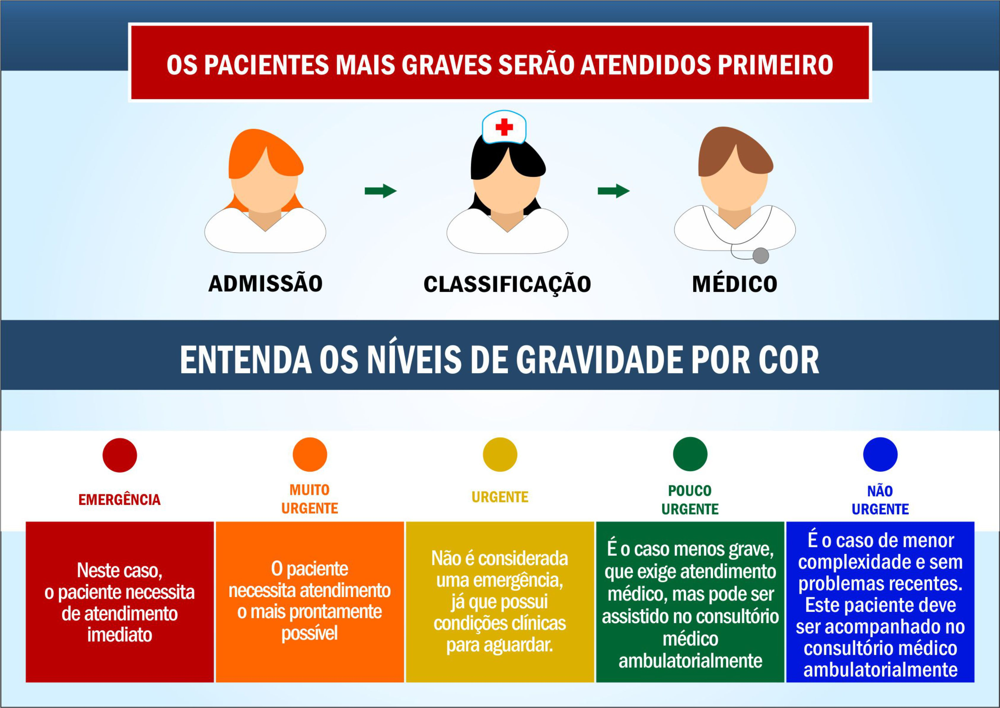

Após o paciente passar pela recepção, o mesmo será chamado pelo nome via painel de chamadas para fazer a Classificação de Risco (ACCR).

>## Acolhimento com classificação de risco
> A classificação de risco é um dispositivo da PNH(Política Nacional de Humanização), uma ferramenta de organização da “fila de espera” no serviço de saúde, para que aqueles pacientes que precisam mais sejam atendidos com prioridade, e não por ordem de chegada.

O enfermeiro realiza uma entrevista com o paciente afim de extrair as informações necessárias, para que com os critérios de classificação o profissional de saúde possa ter a suscinta avaliação do paciente.

Esse processo é realizado no formulário de Classificação de Risco.

>**Obs.:** Para acessar o formulário, basta o profissional Enfermeiro clicar no botão **Classificação de Risco** que está bem visível na parte superior da tela.

Ao finalizar o formulário o enfermeiro salva e imprime o documento de impressão.

### Documento de Impressão

>**Obs.:** O profissional obrigatoriamente terá que imprimir o documento de impressão para poder assinar e carimbar o mesmo e anexar documento ao prontuário fisico do paciente.
